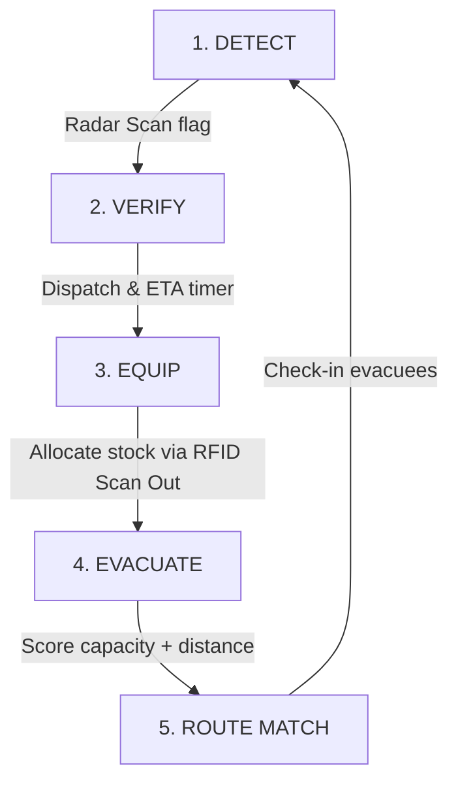

# Connected Relief & Survivor Detection Dashboard — Architecture & User Guide

This system is a React-based single-page command dashboard designed for emergency response operations. It implements a high-contrast, tactical dark-mode aesthetic styled using Tailwind CSS, and is fully optimized for mesh-networked environments.

---

## 🧭 Operational Narrative Flow
The dashboard is designed around the search-and-rescue lifecycle: **Detect → Verify → Equip → Evacuate**.
To help demonstrate this, the dashboard features an interactive **Operations Loop** located in the sidebar:

1. **Detect**: The system scans passive radio frequency and thermal sensors. An anomaly is detected (e.g., in **Zone Alpha**).
2. **Verify**: The operator clicks the **Dispatch Team for Verification** button next to high-confidence anomalies, initiating a real-time dispatch countdown (8 seconds) to simulate a physical team reaching the grid coordinates.
3. **Equip**: Once verified, the team confirms survivors. The operator is directed to the **Relief Inventory** module to scan out emergency supplies (e.g., Drinking Water or Blankets) to equip the team.
4. **Evacuate**: The operator is guided to the **Shelter Capacity** module. Clicking **Find Nearest Suitable Shelter** triggers the safety-capacity routing algorithm to match the survivors to the optimal shelter, followed by checking them in to complete the operational cycle.

---

## 📡 Survivor Detection Module (Sonar Radar Map & Telemetry)
The left panel renders a real-time simulated tactical sonar scan with sweeping visual sweep lines, concentric distance rings, coordinate grids, and glowing **Probable Survivor Zones** scaled by their search radius (e.g., 6 meters).

- **No Exact Pinpoints**: Survivor locations are shown as probabilistic circles, protecting operational uncertainty margins.
- **Explainable Confidence Score (Calibration)**: Every detection has a confidence rating based on specific contributing sensor counts:
  - **High Confidence (90%)**: Requires **BLE + Thermal + UWB** sensor evidence. Validates pulse, heat, and RF device signatures.
  - **Medium Confidence (65%)**: Requires **BLE + Thermal** sensor evidence. Validates device proximity and heat, lacking vitals confirmation.
  - **Low Confidence (30%)**: Requires **BLE only** sensor evidence. Weak radio ping only.
- **Verification Dispatch**: Operators can click **Dispatch Team for Verification** next to high-confidence anomalies in the list to dispatch a search team, writing detailed coordinates and timing info to the tactical log feed.

---

## 📦 Relief Inventory Module (RFID Gate Scanner)
A data registry tracking five categories of emergency items. It displays locations (Warehouse vs. Shelter Clinic) and tag types.

- **Gate Simulation**: The operator can click **Scan In** (+10 units) and **Scan Out** (-10 units) to simulate RFID gate checkpoints.
- **Low Stock Alerts**: Any category falling below its safety threshold (e.g., Medicines under 45) is highlighted in **tactical red** with an active warning alert banner.

---

## 🏥 Shelter Management Module (Distance & Capacity Optimization)
Lists three shelters with real-time capacity and distance metrics, allowing manual check-in/out of evacuees.

### 🧮 Multi-Criteria Routing Algorithm
When clicking **Find Nearest Suitable Shelter**, the system runs an optimization score balancing mesh distance coordinates and available safety capacity:

$$\text{Suitability Score} = (\text{Available Capacity} \times 1.5) - (\text{Distance in km} \times 10)$$

#### Calculation Breakdown (Default Mock State):
* **Shelter Alpha (Community Center)**: 
  * Distance: $1.2\text{ km}$, Available slots: $2$ (Occupancy: $198/200$)
  * $\text{Score} = (2 \times 1.5) - (1.2 \times 10) = 3 - 12 = \mathbf{-9.0}$ (Too full!)
* **Shelter Beta (High School Gym)**: 
  * Distance: $2.8\text{ km}$, Available slots: $170$ (Occupancy: $180/350$)
  * $\text{Score} = (170 \times 1.5) - (2.8 \times 10) = 255 - 28 = \mathbf{+227.0}$ (High capacity margin, reasonable distance — **RECOMMENDED**)
* **Shelter Gamma (Regional Sports Arena)**: 
  * Distance: $4.5\text{ km}$, Available slots: $80$ (Occupancy: $420/500$)
  * $\text{Score} = (80 \times 1.5) - (4.5 \times 10) = 120 - 45 = \mathbf{+75.0}$ (Moderate capacity, further away)

The system automatically recommends **Shelter Beta** because routing evacuees to the closer Shelter Alpha would immediately overload its local resources.
* **Instant Recalculation**: Clicking the `+` or `-` check-in gates immediately updates the capacity metrics and automatically recalculates the recommendation score and highlights in real time.

---

## 🌐 Network Status (Mesh / Offline Logic)
The terminal supports functional network toggles in the top right header:
* **Mesh Connected / Cloud Syncing**: Synchronizes data points and keeps the global **Sync Pulse** running.
* **Offline Mode (Local Cache)**: 
  * **Freezes global sync timestamps**: The header displays `⚠️ SYNC FROZEN` and ceases updating network clock pulses.
  * **Telemetry Pauses**: Stop receiving remote telemetry updates on the radar map; local modifications are cached.
  * **Stale Data Warning**: If the system remains in **Offline Mode** for more than 10 simulated minutes (10 wall-time seconds), a flashing warning banner appears at the top of the Inventory and Shelter tabs. Data numbers dim, and timestamps are replaced with `⚠️ STALE LOCAL CACHE` to warn search teams of potentially desynchronized capacity numbers.
