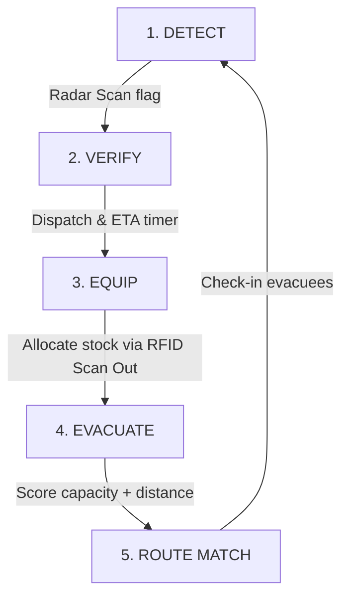

# 🌌 AETHER — AI-Powered Disaster Response & Relief Management System

AETHER is a React-based single-page tactical command dashboard designed for emergency response operations. Built with React, Vite, and Tailwind CSS, it is optimized for high-contrast visibility and offline resilience, enabling search-and-rescue teams to coordinate actions under compromised network conditions (mesh network topology).

---

## 🧭 The Operational Narrative Flow

The dashboard is structured around the critical four-stage search-and-rescue lifecycle: **Detect → Verify → Equip → Evacuate**. This sequence is guided by an interactive **Operations Loop** sidebar:



1. **Detect**: Passive RF and thermal sensors scan the region to locate survivor signatures (e.g., in **Zone Alpha**).
2. **Verify**: The operator dispatches a verification team to confirm survivors, triggering a real-time 8-second verification countdown.
3. **Equip**: Once verified, the operator is directed to the **Relief Inventory** module to scan out required resources (e.g., blankets, water, medicines).
4. **Evacuate**: The system routes survivors to the most suitable shelter based on available capacity and distance calculations.

---

## 📡 Core System Modules

### 1. Survivor Detection & Sonar Radar Map
* **Tactical Radar Sweep**: A real-time simulated circular sonar sweep highlighting probable survivor coordinates.
* **Explainable Confidence Scores**: Survivor detections are categorized based on active sensor evidence:
  * **High Confidence (90%)**: Requires **BLE + Thermal + UWB** (Bluetooth Low Energy, Heat signatures, and Ultra-Wideband respiration indicators).
  * **Medium Confidence (65%)**: Requires **BLE + Thermal**.
  * **Low Confidence (30%)**: Requires **BLE only** (weak radio ping).
* **Team Dispatch**: Integrated buttons let the operator log dispatches and coordinate field agents on specific coordinates.

### 2. RFID Relief Inventory Gate Scanner
* **Interactive Scan Gates**: Operators can simulate RFID gate checkpoints using **Scan In (+10)** and **Scan Out (-10)** controls.
* **Low Stock Warning Alerts**: Dynamic threshold monitoring highlights critical items (e.g., Medicines falling below 45 units) in a flashing tactical red warning alert.

### 3. Smart Shelter Management & Routing
* **Optimized Capacity Routing**: Instead of sending all survivors to the nearest shelter (which could quickly overload it), the dashboard implements a multi-criteria optimization algorithm:
  
  $$\text{Suitability Score} = (\text{Available Capacity} \times 1.5) - (\text{Distance in km} \times 10)$$
  
* **Real-time Recalculation**: Adjusting capacity metrics (via check-in/check-out gates) instantly updates suitability rankings and updates recommended shelters (e.g., recommending a slightly further shelter with abundant room over a closer, nearly-full shelter).

### 4. Mesh-Network Offline Mode
* **Status Toggles**: Easily toggle the command dashboard between **Connected** (real-time telemetry and global database sync) and **Offline Mode**.
* **Offline Caching**: Telemetry freezes and local edits are cached.
* **Stale Cache Warnings**: If left offline for too long, warnings appear, indicating that the displayed capacity metrics might be desynchronized with other mesh nodes.

---

## 🛠️ Technology Stack

* **Frontend Library**: React (v19)
* **Build Tooling**: Vite
* **Styling**: Tailwind CSS
* **Icons**: Lucide React
* **Linting / Static Analysis**: Oxlint (Oxc-based high-performance linter)

---

## 🚀 Getting Started

### 📋 Prerequisites
Ensure you have [Node.js](https://nodejs.org/) installed (v18+ recommended).

### ⚙️ Installation
1. Clone the repository and navigate to the project directory:
   ```bash
   cd Disaster_cisco
   ```
2. Install the required dependencies:
   ```bash
   npm install
   ```

### 💻 Running Locally
To launch the interactive dashboard in development mode with Hot Module Replacement (HMR):
```bash
npm run dev
```
Open your browser and navigate to the local address displayed in the terminal (usually `http://localhost:5173`).

### 📦 Building for Production
To build the application for deployment:
```bash
npm run build
```
To preview the production build locally:
```bash
npm run preview
```

### 🧹 Linting
The project uses `oxlint` for lightning-fast lints:
```bash
npm run lint
```
